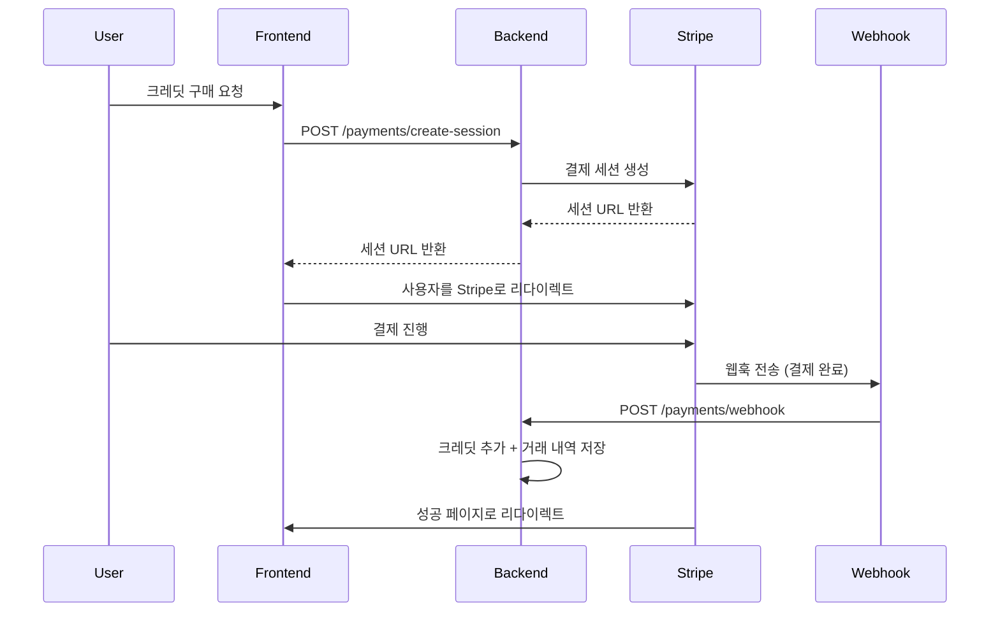

# 🔥 Stripe 결제 시스템 설정 가이드

## 1. 환경변수 설정

`.env` 파일에 다음 변수들을 추가하세요:

```bash
# Stripe 설정
STRIPE_SECRET_KEY="sk_test_YOUR_STRIPE_SECRET_KEY_HERE"
STRIPE_PUBLISHABLE_KEY="pk_test_YOUR_STRIPE_PUBLISHABLE_KEY_HERE"
STRIPE_WEBHOOK_SECRET="whsec_YOUR_WEBHOOK_SECRET_HERE"

# Frontend URL (결제 리다이렉트용)
FRONTEND_URL=http://localhost:3001
```

## 2. Stripe 계정 설정

### 2.1 테스트 키 가져오기
1. [Stripe Dashboard](https://dashboard.stripe.com/) 로그인
2. **개발자** > **API 키** 메뉴 이동
3. **테스트 데이터 보기** 토글 활성화
4. **비밀 키(Secret key)** 복사하여 `STRIPE_SECRET_KEY`에 설정

### 2.2 웹훅 설정
1. Stripe Dashboard > **개발자** > **웹훅** 메뉴
2. **엔드포인트 추가** 클릭
3. 엔드포인트 URL: `http://localhost:3003/payments/webhook`
4. 이벤트 선택:
   - `checkout.session.completed` ✅
   - `checkout.session.expired` ✅
   - `payment_intent.payment_failed` ✅
5. 웹훅 생성 후 **서명 비밀** 복사하여 `STRIPE_WEBHOOK_SECRET`에 설정

## 3. 결제 플로우



## 4. 데이터베이스 구조

### Payment 테이블
```sql
- stripeSessionId: Stripe 세션 ID
- amount: 결제 금액 (센트 단위)
- status: pending/completed/failed
- creditsGranted: 제공된 크레딧 수
```

### CreditTransaction 테이블
```sql
- type: purchase/usage/refund/bonus
- amount: 크레딧 변동량 (+/-)
- balanceAfter: 거래 후 잔액
- paymentId: 결제 ID (선택사항)
```

## 5. 테스트 카드 번호

Stripe 테스트 환경에서 사용할 수 있는 카드 번호들:

- **성공**: 4242 4242 4242 4242
- **카드 거절**: 4000 0000 0000 0002
- **부족한 잔액**: 4000 0000 0000 9995
- **만료일**: 미래 날짜 (예: 12/34)
- **CVC**: 임의 3자리 (예: 123)

## 6. 가격 정책

- **1페이지 = 10크레딧 = $0.10**
- **10페이지 = 100크레딧 = $1.00**
- 크레딧은 만료되지 않음
- 대량 구매 시 보너스 크레딧 제공

## 7. 실제 운영 시 주의사항

1. **환경변수 보안**: 실제 Stripe 키는 절대 코드에 하드코딩하지 말것
2. **HTTPS 필수**: 운영 환경에서는 반드시 HTTPS 사용
3. **웹훅 검증**: Stripe 서명 검증은 보안상 필수
4. **에러 처리**: 결제 실패, 웹훅 실패 등에 대한 적절한 처리
5. **로깅**: 모든 결제 관련 이벤트는 로그로 기록

## 8. 유용한 명령어

```bash
# 백엔드 실행
npm run start:dev

# 프론트엔드 실행
npm run dev

# 데이터베이스 리셋
npx prisma db push

# Stripe CLI (웹훅 테스트용)
stripe listen --forward-to localhost:3003/payments/webhook
```

## Testing with Stripe CLI

1. Install Stripe CLI
2. Login: `stripe login`
3. Forward webhooks: `stripe listen --forward-to localhost:3003/payments/webhook`
4. Use test cards from Stripe documentation

## Test Cards

- Success: `4242 4242 4242 4242`
- Decline: `4000 0000 0000 0002`
- Require 3D Secure: `4000 0025 0000 3155` 